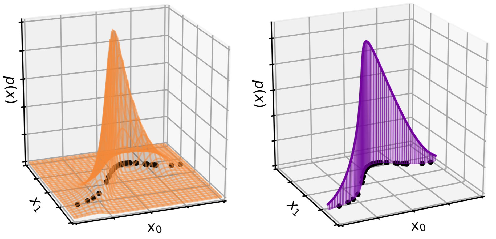

# Manifold-learning flows

*Johann Brehmer and Kyle Cranmer 2019-2020*

In the paper [Flows for simultaneous manifold learning and density estimation](https://arxiv.org/abs/2003.13913) we introduce manifold-learning flows or ℳ-flows, a new class of generative models that simultaneously learn the data manifold as well as a tractable probability density on that manifold. This repository contains our implementation of ℳ-flows, as well as the code for our experiments with them.

**If you do not need the commit history and want to save space, use the `public` branch.**

**Note that this repository is still under development and we're breaking and mending things constantly!**

### Getting started

Please make sure your Python environment satisfies the requirements in the [environment.yml](environment.yml). To use the OT training, please also follow the [installation instructions for geomloss](https://www.kernel-operations.io/geomloss/api/install.html).

### Data sets

Data set | Data dimension | Manifold dimension | Model parameters | Arguments to `train.py`, and `evaluate.py`
--- | --- | --- | --- | ---
Gaussian on an `n`-sphere | `d` | `n` | - |  `--dataset spherical_gaussian --truelatentdim n --datadim d --epsilon eps`
Conditional Gaussian on a `n`-sphere | `d` | `n` | 2 | `--dataset conditional_spherical_gaussian --truelatentdim n --datadim d`
Mixture model on a polynomial manifold | 3 | 2 | 1 | `--dataset power`
Lorenz system | 3 | 2 | 0 | `--dataset lorenz`
Particle physics | 40 | 14 | 2 | `--dataset lhc40d`
2-D StyleGAN image manifold | 64 x 64 x 3 | 2 | 0 | `--dataset gan2d`
64-D StyleGAN image manifold | 64 x 64 x 3 | 64 | 1 | `--dataset gan64d`
CelebA-HQ | 64 x 64 x 3 | ? | 0 | `--dataset celeba`
ImageNet | 64 x 64 x 3 | ? | 0 | `--dataset imagenet`

The data from most data sets should automatically download when required. It is not necessary to generate any data yourself anymore. If there is a problem with that, please let us know.

### Training 

See [experiments/train.py -h](experiments/train.py). The configurations for the models in the paper can be found in [experiments/configs](experiments/configs).

Note that the algorithms have different internal names from the acronyms in the paper:

Model (algorithm) | Arguments to `train.py`
--- | ---
Ambient flow (AF) | `--algorithm flow`
Flow on manifold (FOM) | `--algorithm mf --specified`
Pseudo-invertible encoder (PIE) | `--algorithm pie`
ℳ-flow, simultaneous training (not recommended) | `--algorithm mf`
ℳ-flow, alternating M/D training  | `--algorithm mf --alternate`
ℳ-flow, sequential M/D training  | `--algorithm mf --sequential`
ℳ-flow, Optimal Transport training  | `--algorithm gamf`
ℳ-flow, alternating Optimal Transport training  | `--algorithm gamf --alternate`
ℳ_e-flow, simultaneous training (not recommended)  | `--algorithm emf`
ℳ_e-flow, alternating M/D training  | `--algorithm emf --alternate`
ℳ_e-flow, sequential M/D training  | `--algorithm emf --sequential`

### Evaluation 

See [experiments/evaluate.py -h](experiments/evaluate.py) and the notebooks in [experiments/notebooks](experiments/notebooks). Note that the algorithms have different internal names from the acronyms in the paper:

Model (algorithm) | Arguments to `train.py`
--- | ---
Ambient flow (AF) | `--algorithm flow`
Flow on manifold (FOM) | `--algorithm mf --specified`
Pseudo-invertible encoder (PIE) | `--algorithm pie`
ℳ-flow (except when OT-trained) | `--algorithm mf`
ℳ-flow, OT training  | `--algorithm gamf`

### Acknowledgements

The code is largely based on the excellent [Neural Spline Flow code base](https://github.com/bayesiains/nsf) by C. Durkan, A. Bekasov, I. Murray, and G. Papamakarios, see [1906.04032](https://arxiv.org/abs/1906.04032) for their paper.
